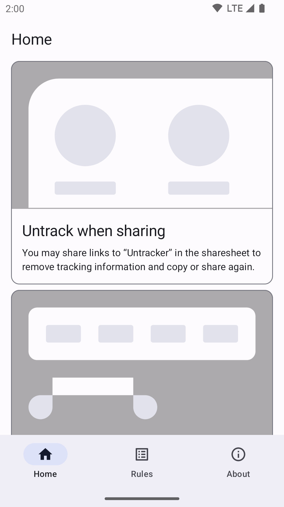
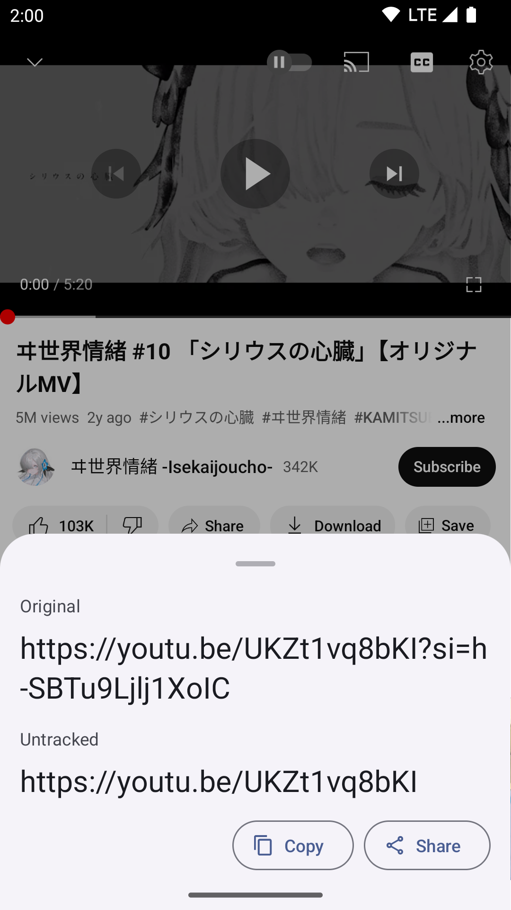

# Untracker

[本文中文版](README_zh-CN.md)

  

App to help you remove tracking information before sharing links.

This is not an officially supported Google product.

 

[Get it on Coolapk](https://www.coolapk.com/apk/me.zhanghai.android.untracker) [Get the APK](https://github.com/zhanghai/Untracker/releases/latest/download/app-release-universal.apk)

## Preview

  

## Features

- Untrack when sharing: You may share links to “Untracker” in the sharesheet to remove tracking information and copy or share again.
- Select to untrack: You may select text and click “Untrack” in the selection toolbar to remove tracking information and replace.
- Manage rules: You may control or add rules to remove tracking information with JavaScript code.

## License

    Copyright 2023 Google LLC

    Licensed under the Apache License, Version 2.0 (the "License");
    you may not use this file except in compliance with the License.
    You may obtain a copy of the License at

        https://www.apache.org/licenses/LICENSE-2.0

    Unless required by applicable law or agreed to in writing, software
    distributed under the License is distributed on an "AS IS" BASIS,
    WITHOUT WARRANTIES OR CONDITIONS OF ANY KIND, either express or implied.
    See the License for the specific language governing permissions and
    limitations under the License.
