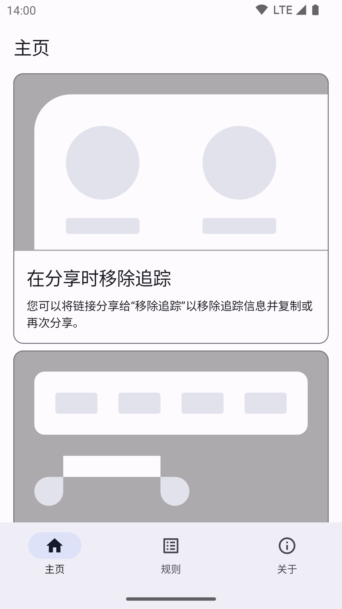
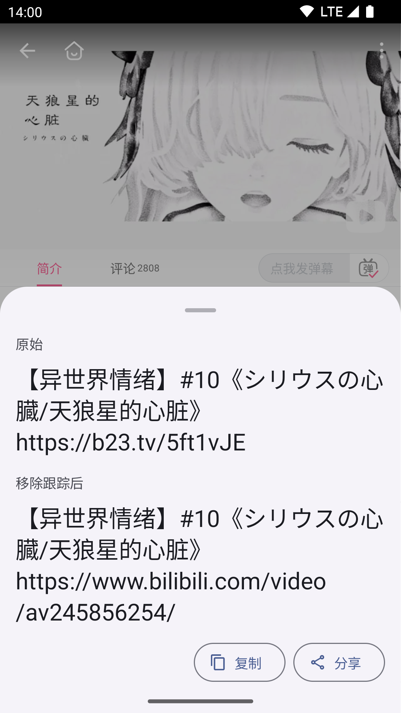
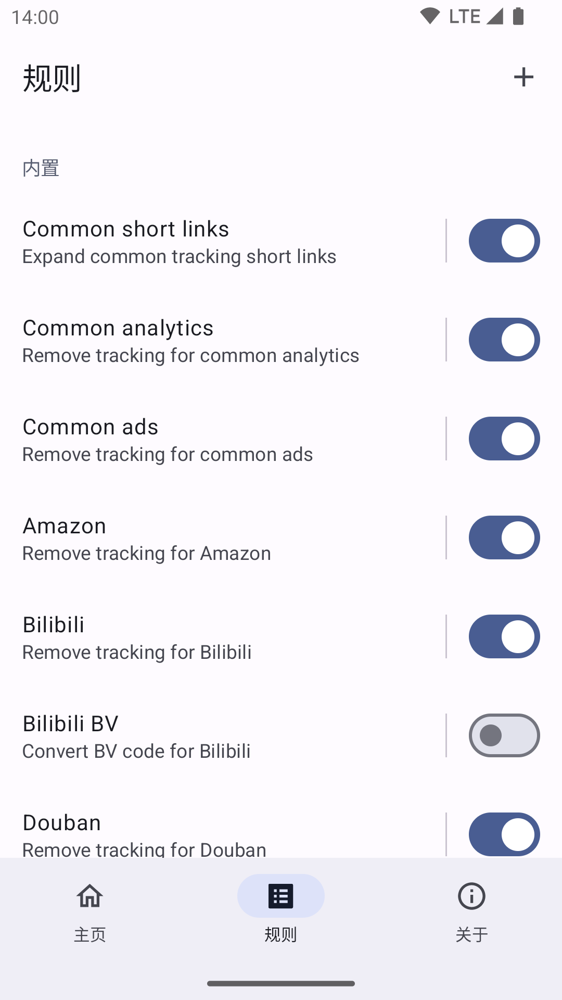

# 移除追踪

  

帮助您在分享链接前移除追踪信息的应用。

这不是一个受到官方支持的 Google 产品。

 

（注：这个应用仍在被 Google Play 审核。）

[下载 APK](https://github.com/zhanghai/Untracker/releases/latest/download/app-release-universal.apk)

## 预览

  

## 功能

- 在分享时移除追踪：您可以将链接分享给“移除追踪”以移除追踪信息并复制或再次分享。
- 选择以移除追踪：您可以选择文本并点击选择工具栏中的“移除追踪”以移除追踪信息并替换。
- 管理规则：您可以控制或添加使用 JavaScript 代码的规则以移除追踪信息。

## 许可证

    Copyright 2023 Google LLC

    Licensed under the Apache License, Version 2.0 (the "License");
    you may not use this file except in compliance with the License.
    You may obtain a copy of the License at

        https://www.apache.org/licenses/LICENSE-2.0

    Unless required by applicable law or agreed to in writing, software
    distributed under the License is distributed on an "AS IS" BASIS,
    WITHOUT WARRANTIES OR CONDITIONS OF ANY KIND, either express or implied.
    See the License for the specific language governing permissions and
    limitations under the License.
